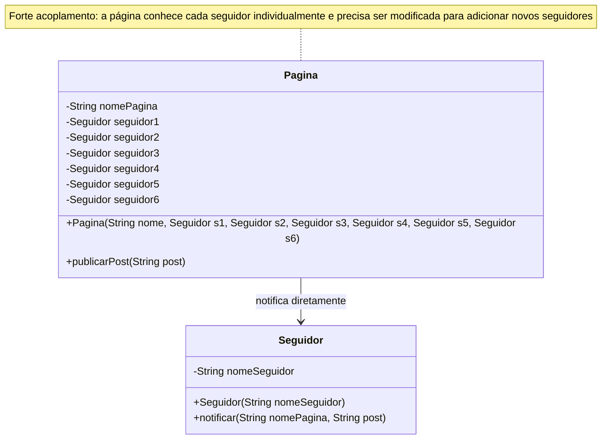

# Diagramas UML: Observer (Anti-Pattern)

```mermaid
classDiagram

    class Pagina {
        -String nomePagina
        -Seguidor seguidor1
        -Seguidor seguidor2
        -Seguidor seguidor3
        -Seguidor seguidor4
        -Seguidor seguidor5
        -Seguidor seguidor6
        +Pagina(String nome, Seguidor s1, Seguidor s2, Seguidor s3, Seguidor s4, Seguidor s5, Seguidor s6)
        +publicarPost(String post)
    }

    class Seguidor {
        -String nomeSeguidor
        +Seguidor(String nomeSeguidor)
        +notificar(String nomePagina, String post)
    }

    Pagina --> Seguidor : notifica diretamente

    note for Pagina "Forte acoplamento: a página conhece cada seguidor individualmente e precisa ser modificada para adicionar novos seguidores"
```