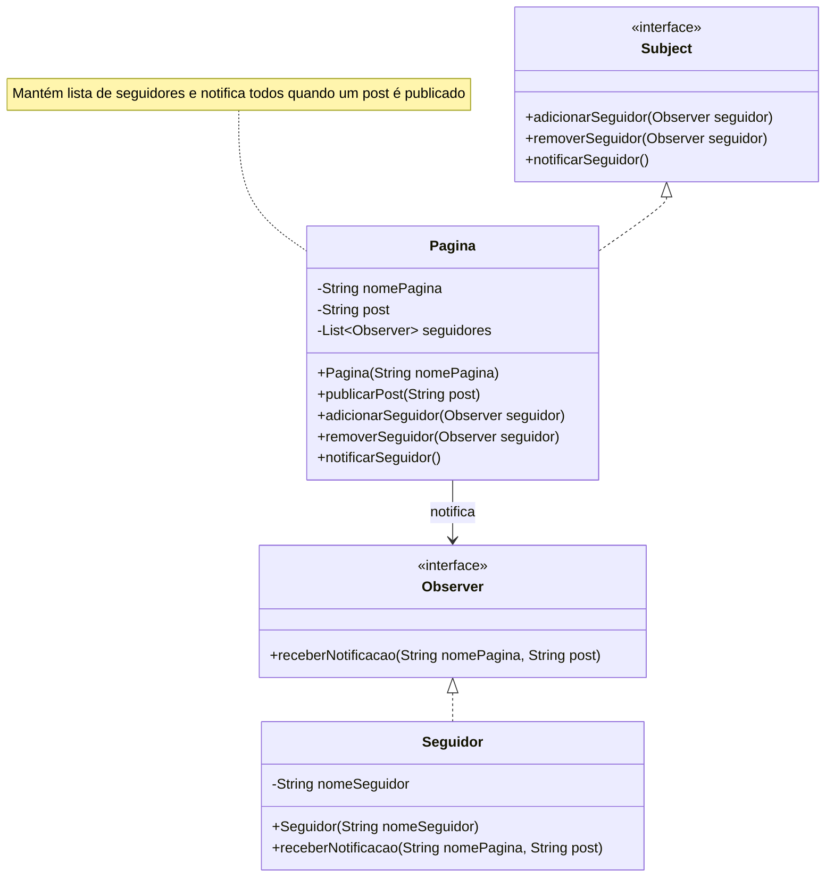

# Diagramas UML: Observer (Pattern)

```mermaid
classDiagram

    class Subject {
        <<interface>>
        +adicionarSeguidor(Observer seguidor)
        +removerSeguidor(Observer seguidor)
        +notificarSeguidor()
    }

    class Observer {
        <<interface>>
        +receberNotificacao(String nomePagina, String post)
    }

    class Pagina {
        -String nomePagina
        -String post
        -List~Observer~ seguidores
        +Pagina(String nomePagina)
        +publicarPost(String post)
        +adicionarSeguidor(Observer seguidor)
        +removerSeguidor(Observer seguidor)
        +notificarSeguidor()
    }

    class Seguidor {
        -String nomeSeguidor
        +Seguidor(String nomeSeguidor)
        +receberNotificacao(String nomePagina, String post)
    }

    Subject <|.. Pagina
    Observer <|.. Seguidor

    Pagina --> Observer : notifica

    note for Pagina "Mantém lista de seguidores e notifica todos quando um post é publicado"
```