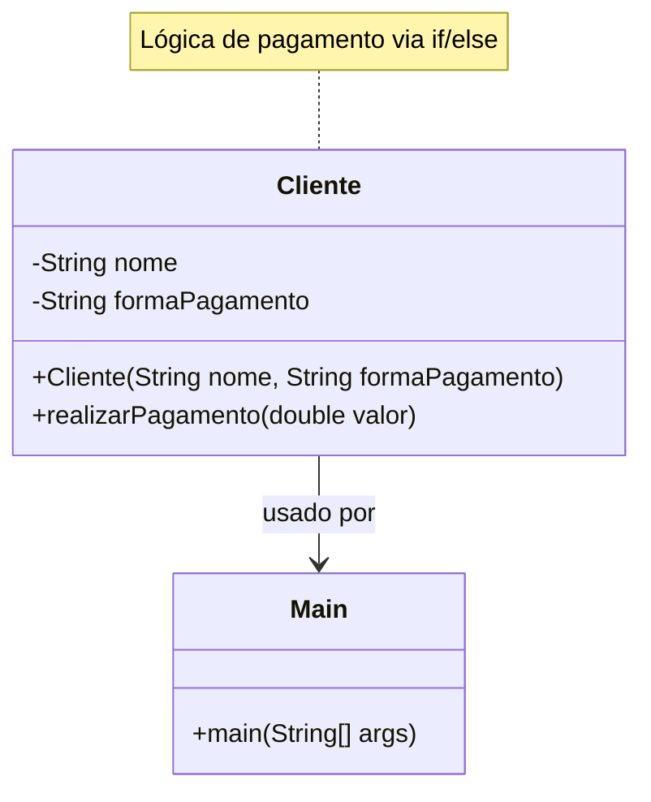

# Diagramas UML: Strategy (Anti-Pattern)

```mermaid
classDiagram

    class Cliente {
        -String nome
        -String formaPagamento
        +Cliente(String nome, String formaPagamento)
        +realizarPagamento(double valor)
    }

    class Main {
        +main(String[] args)
    }

    Cliente --> Main : usado por

    note for Cliente "Lógica de pagamento via if/else"
```