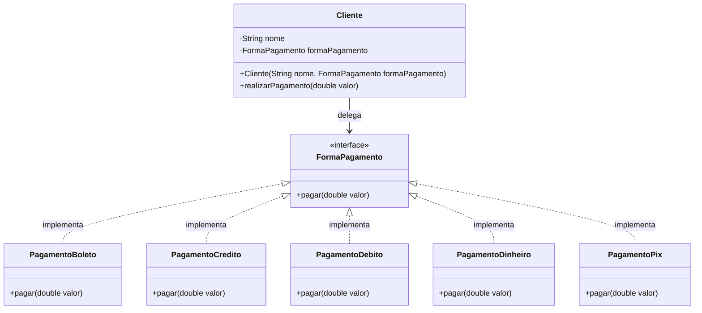

# Diagrama UML: Strategy (Pattern)

```mermaid
classDiagram

    class Cliente {
        -String nome
        -FormaPagamento formaPagamento
        +Cliente(String nome, FormaPagamento formaPagamento)
        +realizarPagamento(double valor)
    }

    class FormaPagamento {
        <<interface>>
        +pagar(double valor)
    }

    class PagamentoBoleto {
        +pagar(double valor)
    }

    class PagamentoCredito {
        +pagar(double valor)
    }

    class PagamentoDebito {
        +pagar(double valor)
    }

    class PagamentoDinheiro {
        +pagar(double valor)
    }

    class PagamentoPix {
        +pagar(double valor)
    }

    Cliente --> FormaPagamento : delega

    FormaPagamento <|.. PagamentoBoleto : implementa
    FormaPagamento <|.. PagamentoCredito : implementa
    FormaPagamento <|.. PagamentoDebito : implementa
    FormaPagamento <|.. PagamentoDinheiro : implementa
    FormaPagamento <|.. PagamentoPix : implementa
```